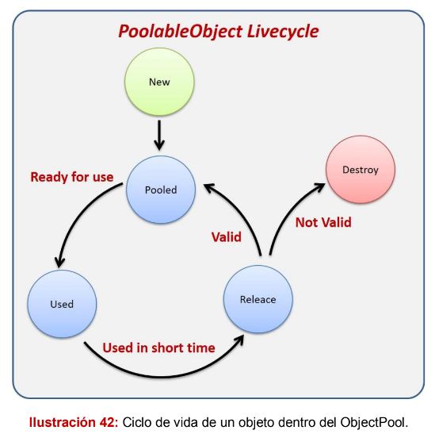
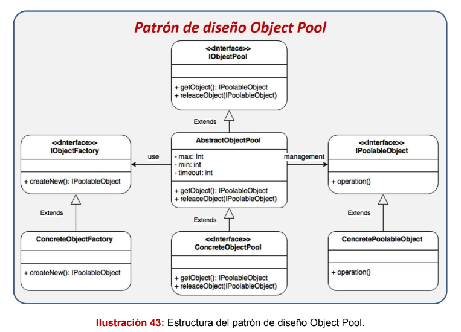
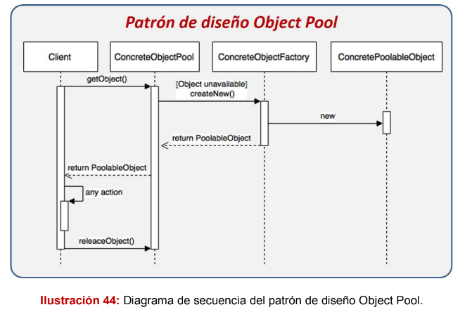
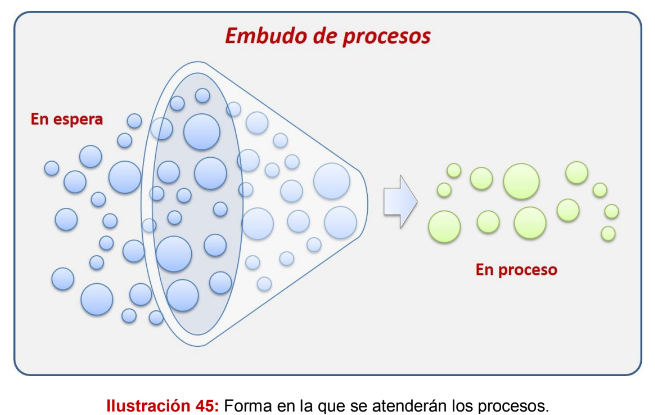
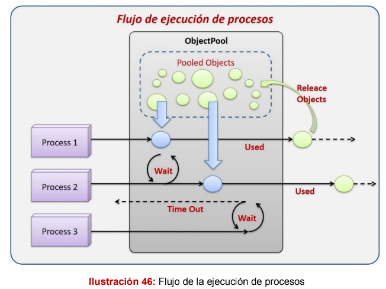
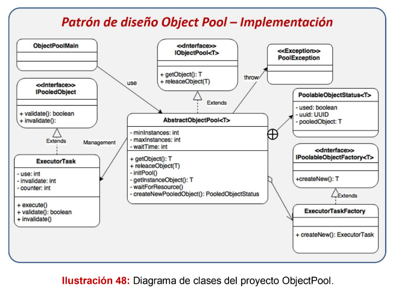

# Patrón Object Pool

Este es un patrón muy utilizado cuando se requiere trabajar con una gran cantidad
de objetos, los cuales son computacionalmente caros de crear. Este patrón tiene
una gran ventaja en escenarios donde nuestro programa requiere dichos objetos
por un corto periodo de tiempo y que luego de eso, son desechados. La ventaja
que brinda este patrón es que nos permite reutilizar los objetos con el fin de evitar
la tarea de crearlos cada vez que nuestra aplicación los requiere, manteniendo
así un almacén de objetos creados previamente para ser utilizados.

## El ciclo de vida de un objeto es el siguiente:
- New: Un nuevo objeto es creado debido a que el ObjectPool no tiene más
objetos disponibles o porque está iniciando y necesita crear las instancias
mínimas.
- Pooled: El objeto nuevo o liberado es puesto nuevamente en el
ObjectPool con el fin de que esté disponible para ser utilizado por otro
proceso.
- Used: El objeto es solicitado por un proceso y no estará disponible hasta
que sea liberado.
- Releace: El objeto es liberado por el proceso que lo solicitó y puesto
nuevamente en el ObjectPool o es destruido en caso de invalidarse.
- Destroy: El objeto es destruido por una solicitud o porque ya no sirve
más.

## El diagrama se interpreta de la siguiente manera:
- El cliente solicita un objeto al ConcreteObjectPool.

- El ConcreteObjectPool valida si existen objetos disponibles, de no ser así,
   solicitará la creación de un nuevo objeto al ConcreteObjectFactory.
- El ConcreteObjectFactory creará un nuevo objeto de tipo
   ConcretePoolableObject.
- El ConcreteObjectPool regresará el objeto al cliente.
- El cliente realiza cualquier acción con el objeto.
- El cliente regresa el objeto al ConcreteObjectPool.

## Cuándo utilizarlo:
- Cuando la creación de los objetos es computacionalmente cara.
- Cuando los objetos son utilizados por un corto periodo y luego son
desechados.
- Mejorar el performance mediante un pool de objetos previamente
creados.

## El escenario:

En este ejemplo, imaginaremos que tenemos que desarrollar una aplicación multi-
hilos, esta aplicación tendrá que hacer muchas tareas de forma simultánea, sin

embargo, por cuestión de rendimiento, tenemos que administrar el número
máximo de procesos que se pueden ejecutar al mismo tiempo, dejando en espera
el resto de procesos; los procesos esperarán hasta que otro finalice para poder
ser ejecutados, si la espera pasa de un tiempo determinado, el programa negará
el servicio y los procesos no serán realizados.
Por cuestión de practicidad, los procesos simplemente se ejecutarán por 10
segundos y terminarán, sin embargo, si lo deseamos podemos implementar
alguna tarea como escribir en una base de datos, consumir un WebService o
procesar algun archivo de texto.

En la imagen podemos apreciar cómo un conjunto de procesos intentan ser
atendidos, pero dicho número será limitado, lo que provocará que los procesos
que lleguen después, tengan que esperar a que los primeros que llegaron
terminen.

